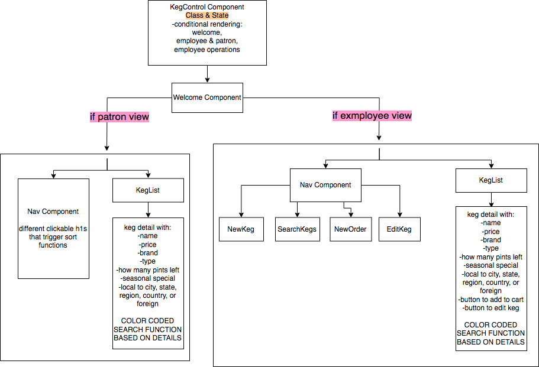

# Tap Room

#### _React Independent Project 07.04.2019_

#### By _Brooke Kullberg_

## Description
_This is a point of sale system for a Tap Room. The application has a separate veiw for the employee and patron. The Patron view is what customers will see as a digital menu. They will see a list of all kegs with color coded information. There will also be a search function that allows users to sort by their desired metrics, for example, type of beer, alcohol by volume, or locality._

_The employee view offers the same list of available kegs and search functionalities, but wth more activities. Employees will be able to add and edit kegs, and create an order._

_This application is currently in-progress, so only the welcome page, employee home page, keg list and new keg page work._

_Enjoy!_

## Project Component Structure - Round 1

  

## Project Component Structure - Round 2

  

## Technologies Used

This project was bootstrapped with [Create React App](https://github.com/facebook/create-react-app), which comes with a dev environment set up with Eslint, Babel, Hot Module, and Webpack. Material UI (https://material-ui.com/) is used for styling. Otherwise, JSX, Javascript, HTML and CSS.

## Setup/Installation Requirements:

_To download the project:_

* _Open via GitHub repository by going to `https://github.com/BrookeZK/tap-room-react`._
* _In your command line (Terminal or another program), navigate to your desktop._
* _In your command line, type "git clone `https://github.com/BrookeZK/tap-room-react` to clone the repository to your desktop._
* _In your command line, navigate into the new folder "iovation-clone"._
* _Once inside "tap-room-react," type "npm install," and your node package manager (npm) (or whatever package manager you use) will install all of the necessary dependencies._

_To run the application:_

* _In your command line, within the "tap-room-react" project folder, type "npm run start," and Angular will compile the files and your web browser will automatically open the Iovation webpage. If it doesn't, navigate to `http://localhost:3000/`._

## Known Bugs

_The is 1 known bug: within the Patron view, after selecting to sort by ascending order of alcohol by volume or price, and then re-selecting 'show all', the keg list does not revert to original master list, even though it is coded to do so._ 

_Currently only the following components are built out: App, Welcome, KegControl, KegList, Keg, Nav, NewKeg._

## Support and contact details

_Should any problems occur, or any bugs discovered, please contact Brooke at brookekullberg@gmail.com_

### License

*This software is licensed under MIT license.*

Copyright (c) 2019 **_Brooke Kullberg_**